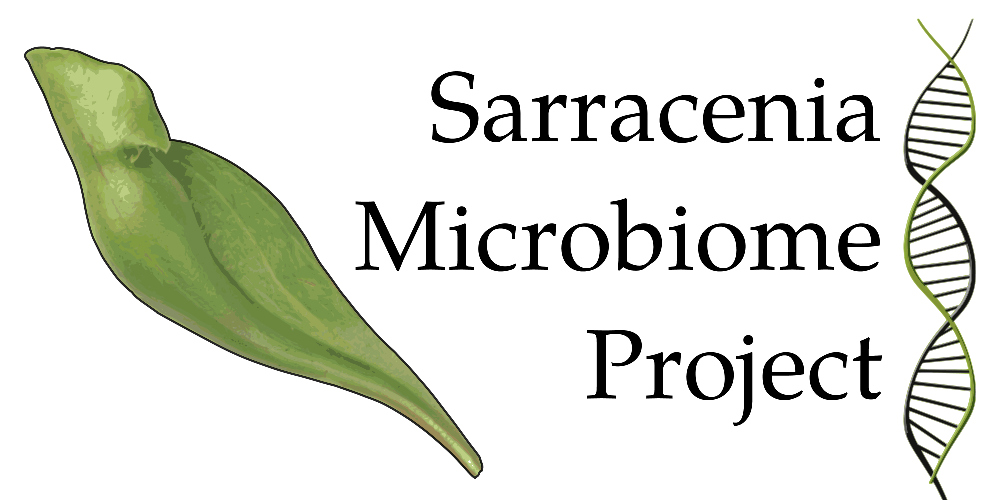

# Sarracenia Microbiome Project

The microbe communities in the pitcher-shaped leaves of different [*Sarracenia*](https://en.wikipedia.org/wiki/Sarracenia) species (aka the pitcher plants) are widely used as model ecosystems in population biology, community ecology and evolutionary biology.
The **Sarracenia Microbiome Project** analyses the composition of this microbial communities with high-trouphput sequencing  the 16S- and 18S rRNA gene and the ITS region. Thereby, comparing the microcosms in their native range in Northern America to introduced populations in Europe and along a temperature gradient within Central Europe.

This repository collects affiliated data-processing scripts and bioinformatical and statistical analyses.

